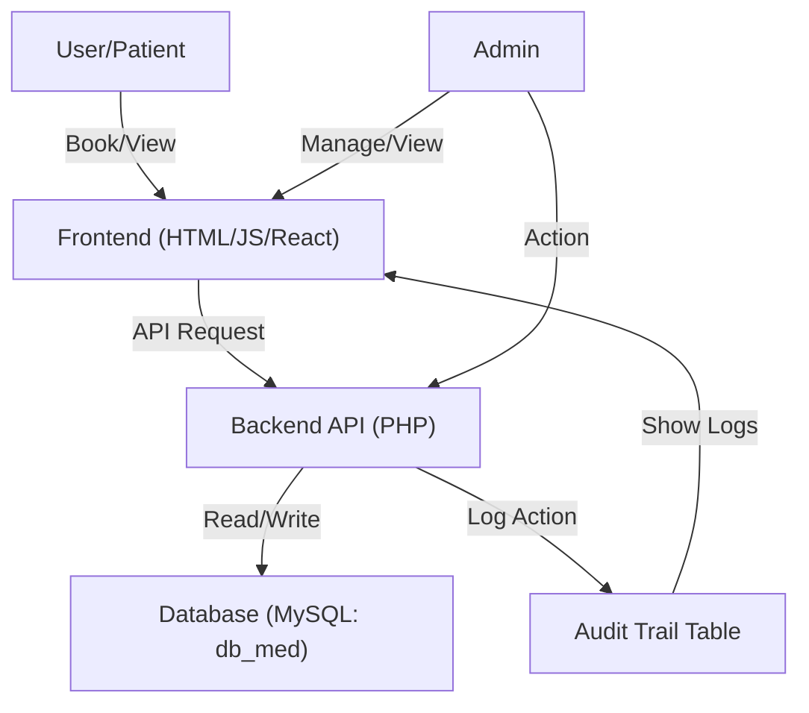

# DocuMed System Diagrams

## Dataflow Diagram (DFD) – Level 1



## Use Case Diagram

```mermaid
%% Use case diagram for DocuMed
%% Mermaid requires 'usecase' keyword for use case diagrams
usecaseDiagram
actor Admin
actor User

Admin --> (Login)
Admin --> (Add/Edit/Delete User)
Admin --> (Change User Password)
Admin --> (Deactivate/Activate User)
Admin --> (View/Archive Medical Record)
Admin --> (Manage Appointments)
Admin --> (Manage Medicine Inventory)
Admin --> (View Audit Trail)
Admin --> (Generate Reports)

User --> (Register/Login)
User --> (Book Appointment)
User --> (View Appointment Status)
User --> (View Medical Record)
User --> (Update Profile)
```

---

**Legend:**
- Frontend: HTML/JS/React
- BackendAPI: PHP API endpoints
- Database: MySQL (db_med)
- AuditTrailTable: audit_trail table

You can copy these Mermaid diagrams into draw.io, VS Code, or any Mermaid-compatible viewer for visualization.
